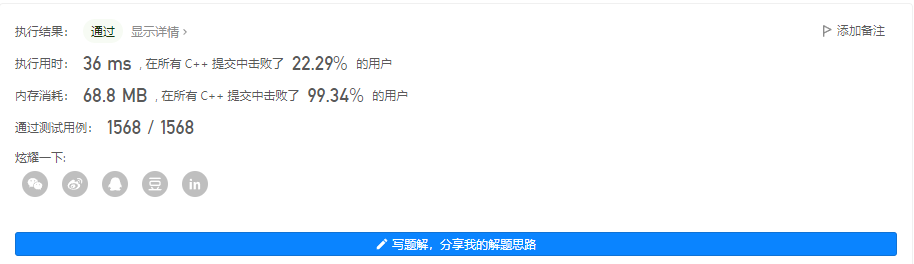
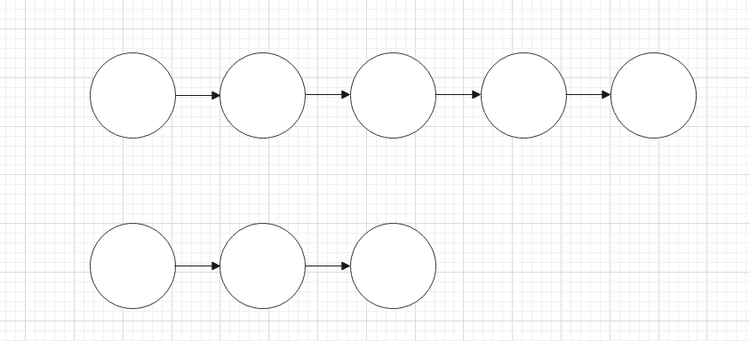
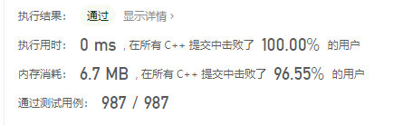
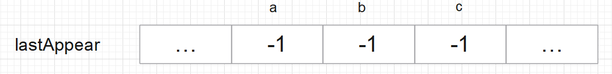
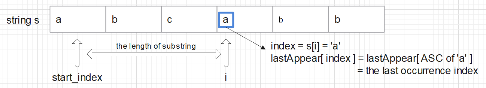
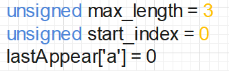

# LeetCode Note

> Created on 7th, Mar, 2022

## Linear Questions

### add-two-numbers

#### [Question](https://leetcode-cn.com/problems/add-two-numbers/submissions/)

#### [Solution](./add-two-numbers.cpp)



<center><b>Result</b></center>

#### Idea



<center><b>Data Structure</b></center>

1. Save memory by selecting a longer linked list to operate on

    ```cpp
    //get the length of two lists
    while (l1_i) {
    	++length1;
    	l1_i = l1_i->next;
    }
    while (l2_i) {
    	++length2;
    	l2_i = l2_i->next;
    }
    //operate on the longer list
    bool longer = (length1 >= length2);
    ListNode* list = longer ? l1 : l2;		//save the longer list in list
    ListNode* other = !longer ? l1 : l2;	//save the shorter list in other
    ```

2. If both lists have nodes, the process is normal

3. When the shorter chain ends, the remaining part of longer chain is connected directly, only carrying is considered


### longest-substring-without-repeating-characters

#### [Question](https://leetcode-cn.com/problems/longest-substring-without-repeating-characters/)

#### [Solution](./longest-substring-without-repeating-characters.cpp)



<center><b>Result</b></center>

#### Idea

1. Use `lastAppear` to store the last occurrence index, the ASC code for each letter is its index

    

2. 

    

When `i` goes from 2 to 3 , which means `s[i] = the second 'a'`, the value of arguments are as follows:



Then the loop begins:

1. `indexOfChar = s[i] = 'a'`

2. `start_index = start_index > (lastAppear[indexOfChar] + 1) ? start_index : (lastAppear[indexOfChar] + 1);`

    1. `lastAppear[indexOfChar] + 1 = 1`
    2. start_index = 0

    So `start_idnex = 1`, this line means, ***When the program reads a char and its index is bigger than one stored in array `lastAppear`, `start_index` goes to the next char after `the char appears repeatedly`***

    This line insures ***the chars between `start_index` and `i` only appear once***, this is very important

3. `max_length = max_length > (i - start_index + 1) ? max_length : (i - start_index + 1);`

    This is easy to understand: ***Compare `max_length` and `the distance from i to start_index`, the bigger one is the maximum***

4. `lastAppear[indexOfChar] = i;`

    Update the last occurrence of the char

