# LeetCode Note

> Created on 7th, Mar, 2022

## Window Questions

### add-two-numbers

#### [Question](https://leetcode-cn.com/problems/add-two-numbers/submissions/)

#### [Solution](./add-two-numbers.cpp)


<center><b>Result</b></center>

#### Idea


<center><b>Data Structure</b></center>

1. Save memory by selecting a longer linked list to operate on

    ```cpp
    //get the length of two lists
    while (l1_i) {
    	++length1;
    	l1_i = l1_i->next;
    }
    while (l2_i) {
    	++length2;
    	l2_i = l2_i->next;
    }
    //operate on the longer list
    bool longer = (length1 >= length2);
    ListNode* list = longer ? l1 : l2;		//save the longer list in list
    ListNode* other = !longer ? l1 : l2;	//save the shorter list in other
    ```

2. If both lists have nodes, the process is normal

3. When the shorter chain ends, the remaining part of longer chain is connected directly, only carrying is considered


### longest-substring-without-repeating-characters

#### [Question](https://leetcode-cn.com/problems/longest-substring-without-repeating-characters/)

#### [Solution](./longest-substring-without-repeating-characters.cpp)


<center><b>Result</b></center>

#### Idea

1. Use `lastAppear` to store the last occurrence index, the ASC code for each letter is its index

    

2. 

    

When `i` goes from 2 to 3 , which means `s[i] = the second 'a'`, the value of arguments are as follows:


Then the loop begins:

1. `indexOfChar = s[i] = 'a'`

2. `start_index = start_index > (lastAppear[indexOfChar] + 1) ? start_index : (lastAppear[indexOfChar] + 1);`

    1. `lastAppear[indexOfChar] + 1 = 1`
    2. start_index = 0

    So `start_idnex = 1`, this line means, ***When the program reads a char and its index is bigger than one stored in array `lastAppear`, `start_index` goes to the next char after `the char appears repeatedly`***

    This line insures ***the chars between `start_index` and `i` only appear once***, this is very important

3. `max_length = max_length > (i - start_index + 1) ? max_length : (i - start_index + 1);`

    This is easy to understand: ***Compare `max_length` and `the distance from i to start_index`, the bigger one is the maximum***

4. `lastAppear[indexOfChar] = i;`

    Update the last occurrence of the char

### longest-palindromic-substring

#### [Question](https://leetcode-cn.com/problems/longest-palindromic-substring/)

#### [Solution](./longest-palindromic-substring.cpp)

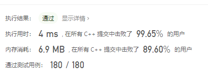

<center><b>Result</b></center>

#### Idea

take this string as example:

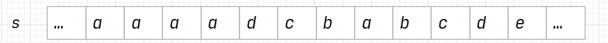

1. In the first part of the loop, `left` will not move, while `right` move to the first char different from `s[left]`:

    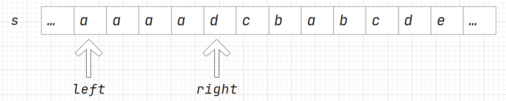

2. Record `right` as `nextLeft`, which means the next position of left, for it is easy to prove that, ***neither character between left and right is the beginning of the next longer substring***. 

    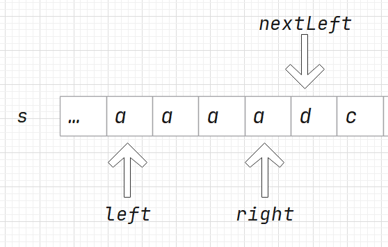

3. Since the chars between `left` and `right` are the same, we can consider them as the center of the palindromic substring. We can move left and right at the same time, compare the chars they point

    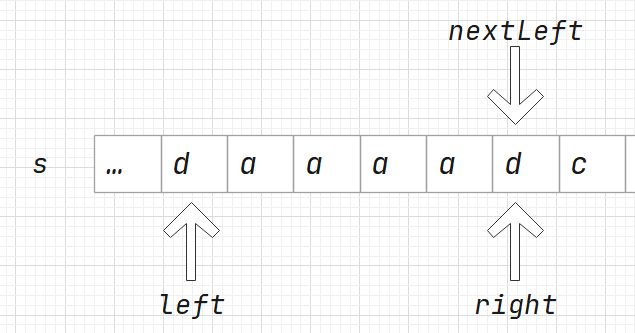


### zigzag-conversion.cpp

#### [Question](https://leetcode-cn.com/problems/zigzag-conversion/)

#### [Solution](./zigzag-conversion.cpp)

#### Idea

##### Method 1 - `string convert(string s, int numRows)`

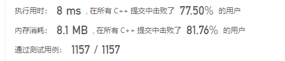

<center><b>Result</b></center>

###### Special Cases Handling

1. If the length of string lower than 2 or `numRows` is 1, just return it.

2. If `numRows` is 2

    In this case, we hope to make `s` into `result` like this:

    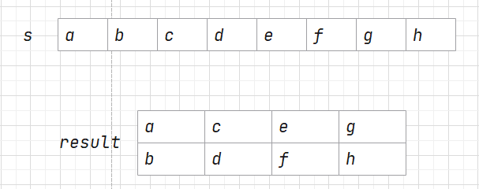

    And `result` in memory is like this:

    So I created two points to solve this case:

    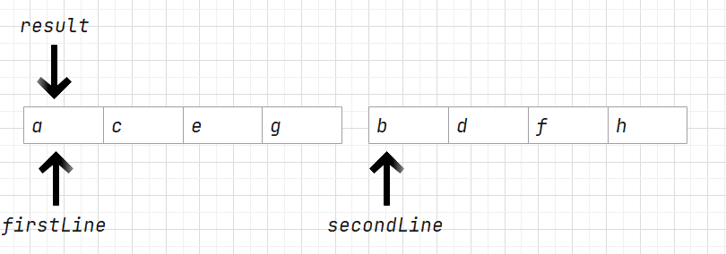

    So everything is clear: 

    - `secondLine = firstLine + half length of the origin string`
    - Read two chars in one loop, the first is for `firstLine` and the second for `secondLine`. What we only need to care about is if we reach end after read the first char

###### Normal Case

In normal case, in my algorithm, things is more complex:

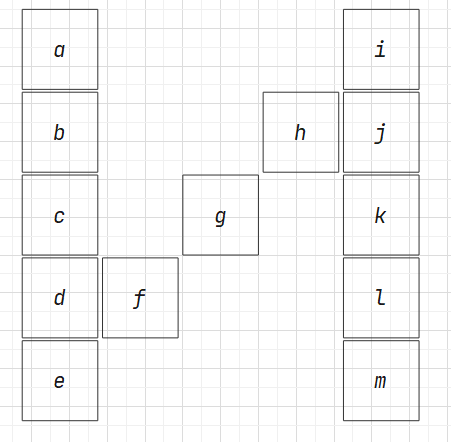

<center><b><i>"abcdrfghijkm" in numRows = 5</i></b></center>

I split them into lines one by one, in this algorithm, the first line is `ai` and the second is `bhj`, ...

**Take the second line as example: **

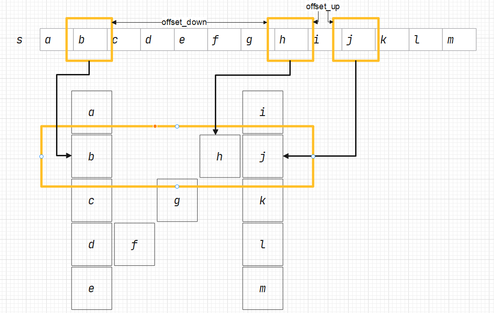

We can find that, the offset is different, as the graph shows, there are 4 chars between `b` and `h` while there is only 1 char between `h` and `j`. So I use `offset_down` and `offset_up` to store the offset lower or higher than this line.

So, there is the second question: **How do we calculate `offset_down` and `offset_up`?

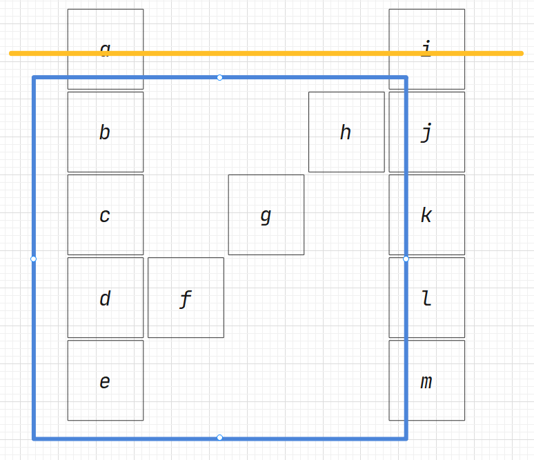

<center><b><i>in the first line, there are 7 chars between 'a' and 'b'</br>which means, address of `a` + 8 = address of 'b'</i></b></center>

On the first line, `offset_down = 8` and `offset_up = 0`

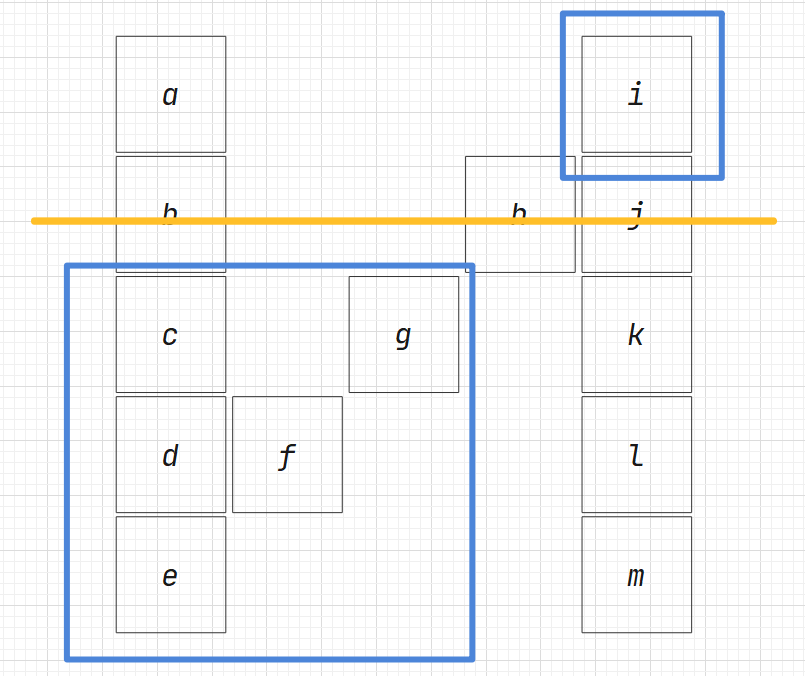

<center><b><i>in the second line, there are 5 chars between 'b' and 'h'</br>address of `b` + 6 = address of 'h'</br>address of 'h' + 2 = addresss of 'j'</i></b></center>

On the second line, `offset_down = 6` and `offset_up = 2`

******

Thus, ***`offset_down + offset_up = 2 * (n - 3) + 4`***

Thus my codes are reasonable.


##### Method 2 - `Solution::string convert(string s, int numRows)`

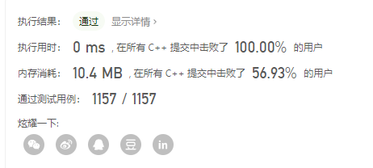

<center><b>Result</b></center>

> This algorithm is from [leetcode](https://leetcode-cn.com)

Let's rotate the graph 90 degrees：

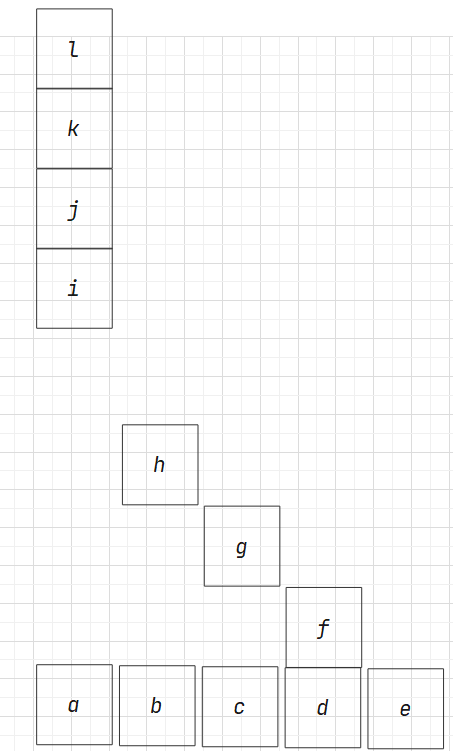

Think of the algorithm as Tetris, with characters from `s` falling down a pipe into the corresponding string, and the pipe moving on to the next string with each character placed. And everything makes sence.

A more memory-saving improvement is to calculate the length of each string when allocating space to each element in a vector.
